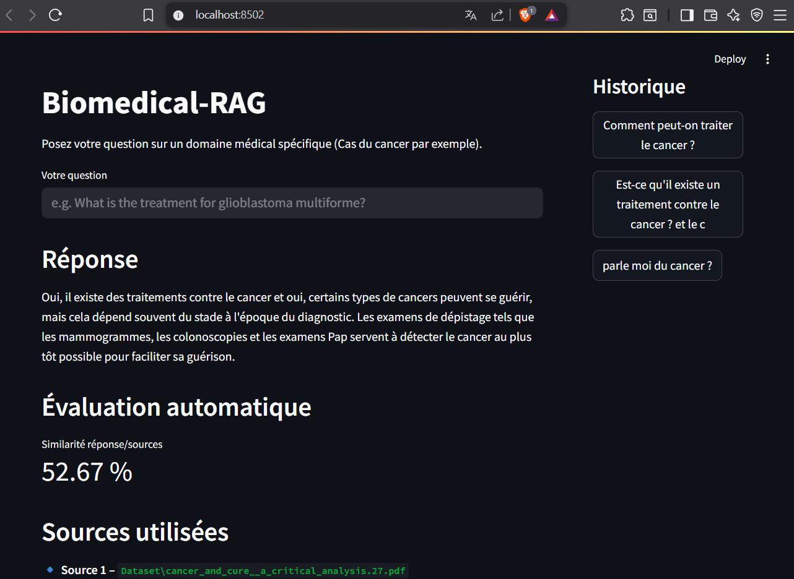
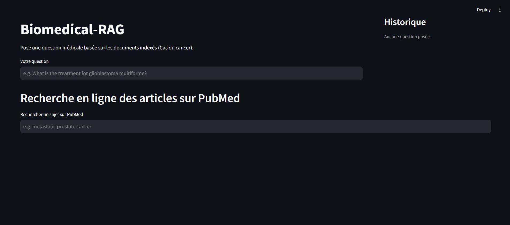
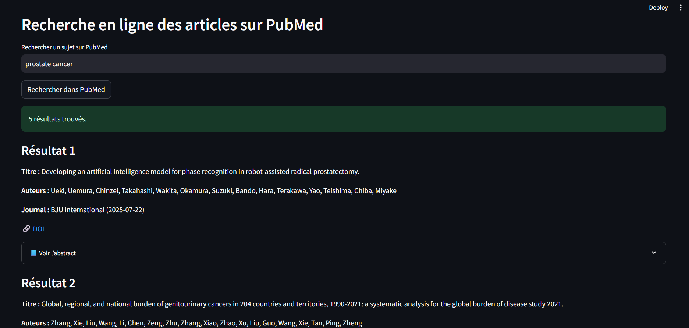
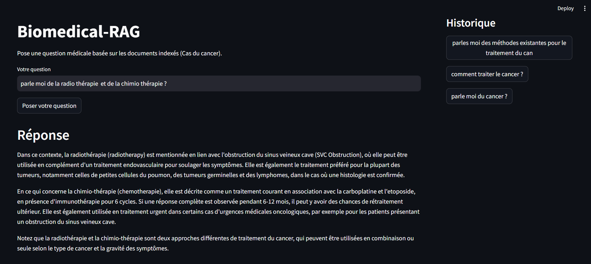

# ChatBioMed-RAG - RAG Biomédical avec LLM local (Ollama + Mistral), PubMed &amp; Évaluation Automatique)

<div align="center">

💡 Un système intelligent de question-réponse et recherche biomédicale, combinant des modèles de langage locaux (Ollama + Mistral), une base documentaire indexée (FAISS), une recherche des articles en ligne sur PubMed et une évaluation automatique des réponses.



</div>


---


## 🚀 Objectifs

**ChatBioMed** est une application  de **Question Answering Research** biomédical spécialisée dans un domaine précis de la médecine (Cas du cancer) conçue pour :

- répondre avec précision à des **questions médicales pointues lié à la spécialité cible**,
- extraire automatiquement des **passages de sources fiables** (documents indexés composant notre Dataset),
- intégrer une **recherche dynamique des articles sur PubMed**,
- évaluer automatiquement la **qualité des réponses générées au texte du document**,
- et fonctionner **localement** avec des outils **open source et gratuit**.
  

---

## ✨ Fonctionnalités

- Interface ergonomique, avec historique cliquable.
- Extraction intelligente de passages pertinents  
- Évaluation de la cohérence des réponses (score de similarité)  
- Recherche documentaire temps réel sur PubMed  
- Intégration 100% locale et respectueuse de la confidentialité  
- Embeddings spécialisés en biomédecine (PubMedBERT)



---

## 📁 Arborescence du projet

```bash
ChatBioMed/
│
├── app/
│   └── ChatBioMed.py                      
│
├── scripts/
│   ├── evaluation.py             
│   ├── pubmed_search.py         
│   └── pubmedbert_embedding.py   
│
├── vectorstore/                 
└── README.md
```

---

## 🧪 Exigences

```bash
  pip install -r requirements.txt
```

---

## ▶️ Installation

1. Assurez-vous qu’Ollama est installé et que le modèle mistral est disponible localement :

```bash
  ollama run mistral
```

2. Lancez l’interface Streamlit :
   
```bash
  streamlit run app/ChatBioMed.py
```

---

## 🧬 Pourquoi ce projet est-il pertinent pour la recherche ?

Ce projet illustre plusieurs problématiques actuelles de la recherche en intelligence artificielle appliquée à la santé :

- L’interrogation assistée de **bases scientifiques**.
- L'utilisation de **modèles open-source optimisés pour des contextes sensibles** (hôpitaux, laboratoires).
- L’**évaluation automatisée de la fiabilité des réponses** générées par des modèles.
- La **convergence entre NLP, IA médicale et systèmes distribués**.

---

## 📚 Références

- **NeuML – PubMedBERT** : [https://huggingface.co/NeuML/pubmedbert-base-embeddings](https://huggingface.co/NeuML/pubmedbert-base-embeddings)
- **Mistral via Ollama** : [https://ollama.com/library/mistral](https://ollama.com/library/mistral)
- **PubMed API** : [https://pubmed.ncbi.nlm.nih.gov/](https://pubmed.ncbi.nlm.nih.gov/)

---

## 💌 Contact

- 👤 **David Lutala**  
- 📧 [davidlutala0@gmail.com](mailto:davidlutala0@gmail.com)  
- 🎓 *Étudiant chercheur — Systèmes Intélligents*  
- 🌐 [linkedin.com/in/David-Lutala](https://www.linkedin.com/in/david-lutala-719952164/ )

---

## 📸 Captures




